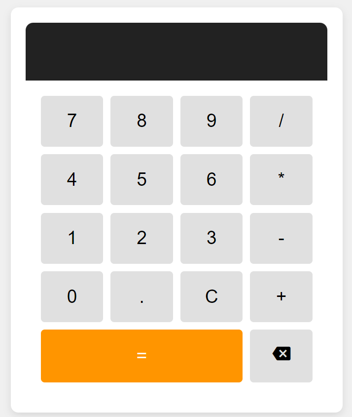

# Simple Calculator

This is a simple calculator web application built using HTML, CSS, and JavaScript. The calculator performs basic arithmetic operations like addition, subtraction, multiplication, and division.

## Features

- Responsive design
- Supports basic arithmetic operations: addition, subtraction, multiplication, and division
- Clear button (`C`) to reset the display
- Backspace functionality to delete the last character
- Calculation of the entered expression

## Project Structure

- **index.html**: The main HTML file that structures the calculator.
- **main.css**: The CSS file that styles the calculator and ensures a responsive design.
- **main.js**: The JavaScript file that adds interactivity, including handling button clicks and performing calculations.

## Usage

To use the calculator:

1. Open `index.html` in a web browser.
2. Use the buttons on the calculator to input numbers and operations.
3. Click `=` to calculate the result.
4. Use `C` to clear the display.
5. Use the backspace button (🡐) to delete the last character.

## How It Works

- **HTML**: Defines the structure of the calculator, including the display and buttons.
- **CSS**: Provides styling for the calculator, making it visually appealing and ensuring it is responsive.
- **JavaScript**:
  - Handles button clicks using event listeners.
  - Updates the display based on the user's input.
  - Evaluates the mathematical expression entered by the user using `eval()` for quick calculations.
  - Includes a backspace functionality to remove the last character from the display.

## Screenshot

---

© 2024 Bhagyashree Basudkar
